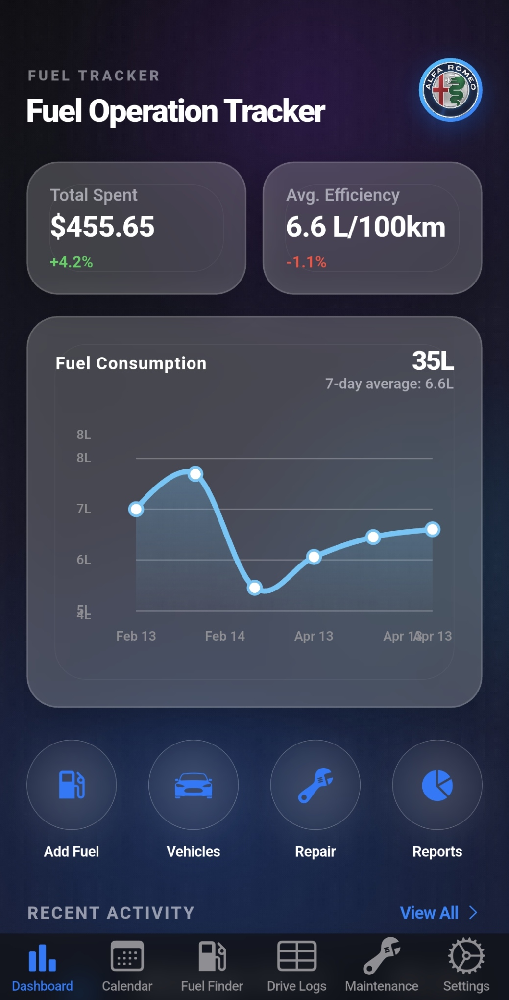
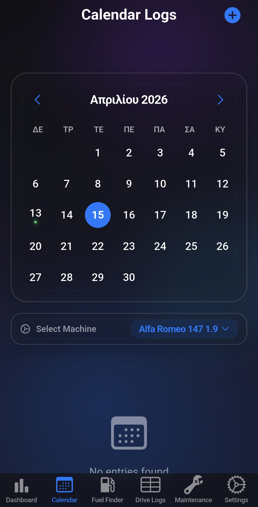
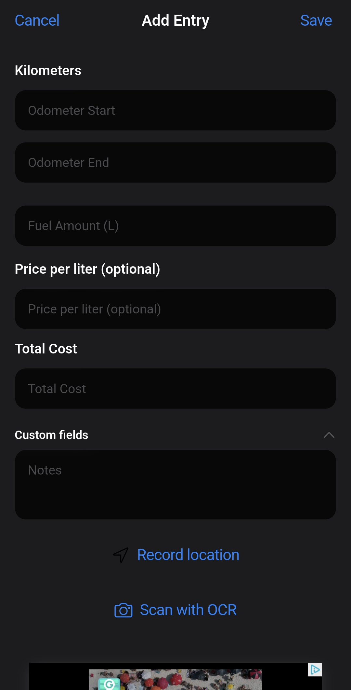

# Fuel Operation Tracker ⛽
### Η Απόλυτη Λύση για την Παρακολούθηση Καυσίμων σε Πραγματικό Χρόνο

> **Unique Selling Point**: Μια premium cross-platform εφαρμογή, σχεδιασμένη με την elite Cupertino αισθητική, που προσφέρει απόλυτο έλεγχο, ασφάλεια και ταχύτητα στη διαχείριση καυσίμων σε Android, iOS, Web και Desktop.

---

## ✨ Βασικά Χαρακτηριστικά (Features)

*   **📊 Παρακολούθηση σε Πραγματικό Χρόνο**: Καταγράψτε και αναλύστε την κατανάλωση καυσίμων με ακρίβεια σε όλες τις συσκευές σας.
*   **🌐 Multi-Platform Excellence**: Μία εφαρμογή, παντού. Απολαύστε κορυφαία αισθητική και native-feel εμπειρία σε iPhone, Android, browser και υπολογιστή.
*   **🌍 Πολυγλωσσική Υποστήριξη (9 Γλώσσες)**: Πλήρως μεταφρασμένο σε: **Ελληνικά, Αγγλικά, Γερμανικά, Γαλλικά, Ισπανικά, Ιταλικά, Ρωσικά, Κινέζικα και Ινδικά**.
*   **🔐 Βιομετρική Ασφάλεια**: Προστασία των δεδομένων σας με FaceID/TouchID ή Fingerprint, συνοδευόμενη από αυτόματο Privacy Screen για απόλυτη ιδιωτικότητα.

---

## 🛠️ Τεχνική Αρτιότητα (Technical Excellence)

Για τους λάτρεις της ποιότητας και της αρχιτεκτονικής, το **Fuel Operation Tracker** έχει χτιστεί με τις πιο σύγχρονες τεχνολογίες στον χώρο του mobile development:

*   **🏗️ Clean Architecture**: Αυστηρός διαχωρισμός σε 4 επίπεδα (Domain, Application, Presentation, Infrastructure) για μέγιστη ευελιξία και επεκτασιμότητα.
*   **⚡ Riverpod State Management**: Χρήση `riverpod_generator` για ασφαλή και αποδοτική διαχείριση της κατάστασης, διασφαλίζοντας μια bug-free εμπειρία.
*   **💾 Offline-First Experience**: Ενσωμάτωση **SQLite (sqflite)** για ταχύτατη πρόσβαση και αποθήκευση δεδομένων χωρίς την ανάγκη σύνδεσης στο internet.
*   **🌙 Dynamic Theming**: Πλήρης υποστήριξη Dark & Light mode με χρήση `CupertinoDynamicColor` για ξεκούραστη χρήση σε όλες τις συνθήκες φωτισμού.
*   **🚀 Premium UX Effects**: Glassmorphism επιρροές στα UI στοιχεία και στοχευμένο Haptic Feedback για μια tactile εμπειρία χρήσης.

---

## 📸 Στιγμιότυπα Εφαρμογής (Screenshots)

  <table border="0">
    <tr>
      <td width="33%" align="center">
         
        <b>Light Mode Dashboard</b>
      </td>
      <td width="33%" align="center">
         
        <b>Dark Mode Stats</b>
      </td>
      <td width="33%" align="center">
         
        <b>Secure Biometrics</b>
      </td>
    </tr>
  </table>

---

## 🤝 Επικοινωνία & Σύνδεση

Είστε ενθουσιασμένοι με το project; Θέλετε να μάθετε περισσότερα για την τεχνική υλοποίηση ή την ημερομηνία κυκλοφορίας;

*   **GitHub**: [@kwstas147](https://github.com/kwstas147)
*   **LinkedIn**: [Συνδεθείτε μαζί μου](https://linkedin.com)
*   **Email**: [infokwstas147@gmail.com]

---

  <i>Αναπτύχθηκε με ❤️ χρησιμοποιώντας Flutter & Clean Architecture.</i>

